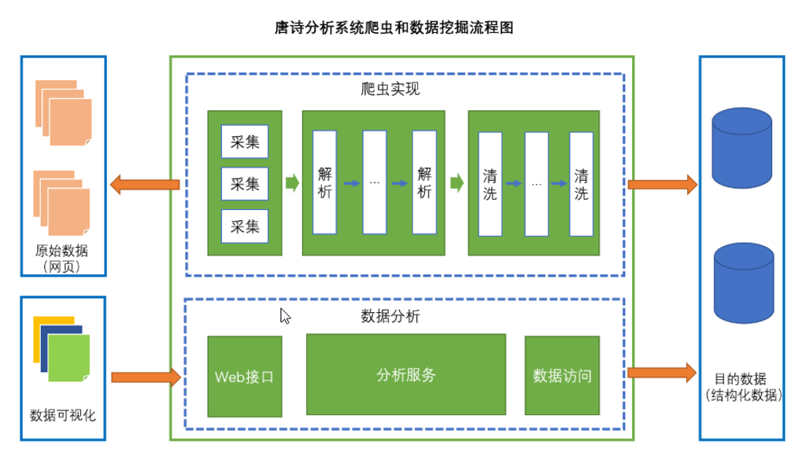
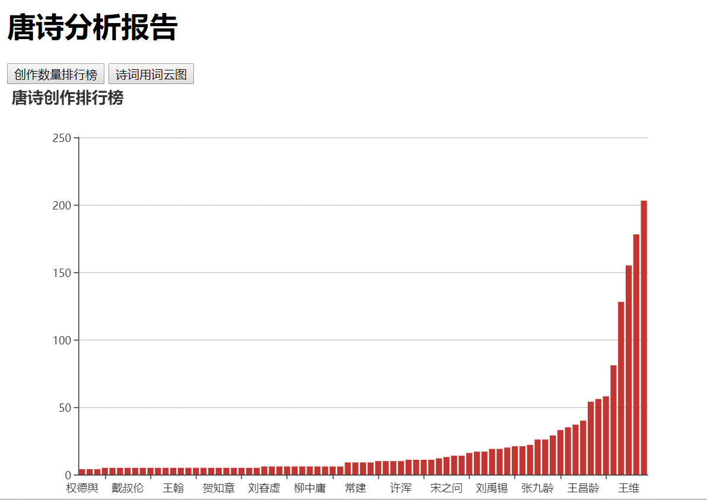

## 项目名称

唐诗分析器

## 项目描述

唐诗分析器主要是从古诗文网上爬取唐诗，记录各个诗人所创诗文及数量并分析出唐诗中所出现的高频词汇

## 涉及技术

+ Stream流式处理
+ 文本分词和解析（ ansj ）
+ 多线程
+ 网页解析工具（ htmlunit ）
+ 数据库和JDBC编程
+ 数据可视化（ HTML/CSS/JavaScript , echarts , jQuery ）

## 实现功能

+ 采集
+ 解析
+ 清洗
+ 查询
+ 分词
+ 统计（功能）
+ 可视化

## 具体实现

## 项目效果

